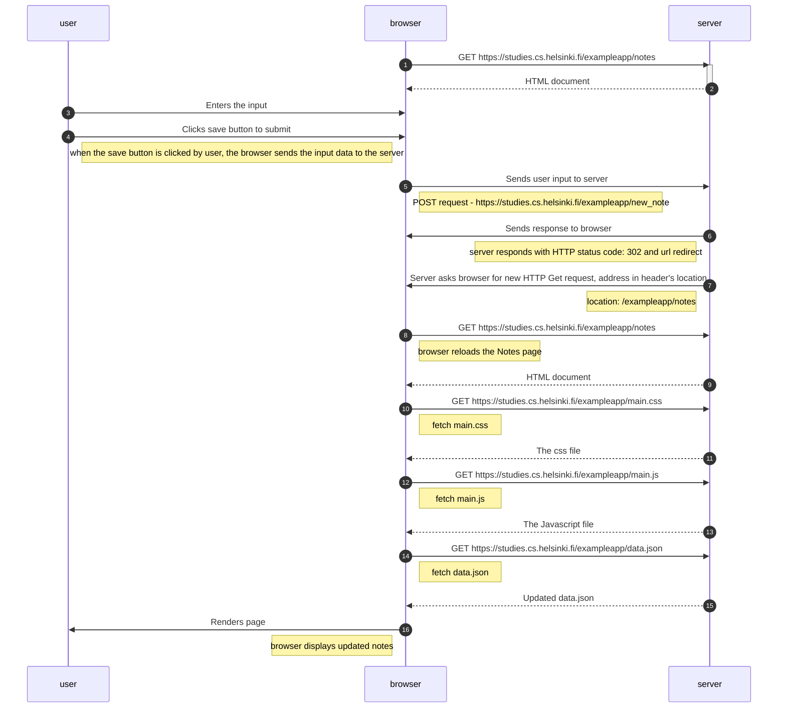

# Exercise 0.4

```mermaid
sequenceDiagram
autonumber
participant user
participant browser
participant server

browser->>server: GET https://studies.cs.helsinki.fi/exampleapp/notes
activate server
server-->>browser: HTML document
deactivate server


user->>browser: Enters the input
user->>browser: Clicks save button to submit
Note right of user: when the save button is clicked by user, the browser sends the input data to the server


browser->>server: Sends user input to server
Note right of browser: POST request - https://studies.cs.helsinki.fi/exampleapp/new_note


server->>browser: Sends response to browser
Note left of server: server responds with HTTP status code: 302 and url redirect


server->>browser: Server asks browser for new HTTP Get request, address in header's location
Note left of server: location: /exampleapp/notes


browser->>server: GET https://studies.cs.helsinki.fi/exampleapp/notes
Note right of browser: browser reloads the Notes page
server-->>browser: HTML document


browser->>server: GET https://studies.cs.helsinki.fi/exampleapp/main.css
Note right of browser: fetch main.css
server-->>browser: The css file


browser->>server: GET https://studies.cs.helsinki.fi/exampleapp/main.js
Note right of browser: fetch main.js
server-->>browser: The Javascript file


browser->>server: GET https://studies.cs.helsinki.fi/exampleapp/data.json
Note right of browser: fetch data.json
server-->>browser: Updated data.json

browser->>user: Renders page
Note left of browser: browser displays updated notes


```
