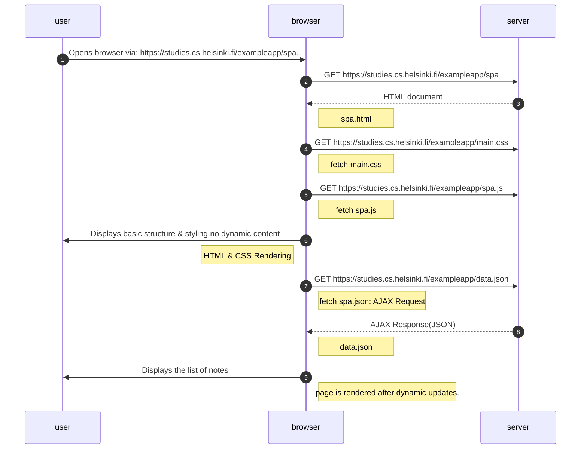

# Exercise 0.5

```mermaid
sequenceDiagram
autonumber
participant user
participant browser
participant server

user->>browser: Opens browser via: https://studies.cs.helsinki.fi/exampleapp/spa.

browser->>server: GET https://studies.cs.helsinki.fi/exampleapp/spa
server-->>browser: HTML document
Note right of browser: spa.html

browser->>server: GET https://studies.cs.helsinki.fi/exampleapp/main.css
Note right of browser: fetch main.css

browser->>server: GET https://studies.cs.helsinki.fi/exampleapp/spa.js
Note right of browser: fetch spa.js

browser->>user: Displays basic structure & styling no dynamic content
Note left of browser: HTML & CSS Rendering

browser->>server: GET https://studies.cs.helsinki.fi/exampleapp/data.json
Note right of browser: fetch spa.json: AJAX Request

server-->>browser: AJAX Response(JSON)
Note right of browser: data.json

browser->>user: Displays the list of notes
Note right of browser: page is rendered after dynamic updates.


```
