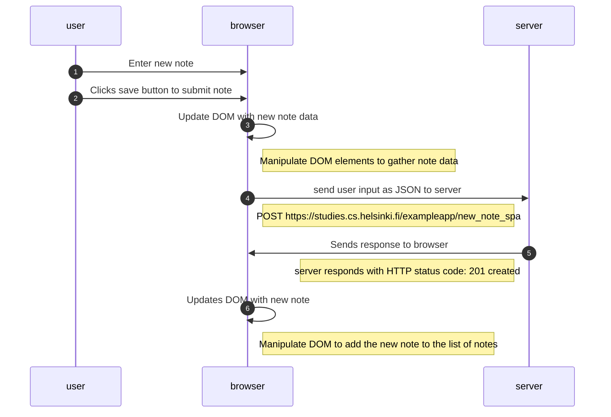

# Exercise 0.6

```mermaid
sequenceDiagram
autonumber
participant user
participant browser
participant server

user->>browser: Enter new note
user->>browser: Clicks save button to submit note

browser->>browser: Update DOM with new note data
Note right of browser: Manipulate DOM elements to gather note data


browser->>server: send user input as JSON to server
Note right of browser: POST https://studies.cs.helsinki.fi/exampleapp/new_note_spa


server->>browser: Sends response to browser
Note left of server: server responds with HTTP status code: 201 created

browser->>browser: Updates DOM with new note
Note right of browser: Manipulate DOM to add the new note to the list of notes

```
